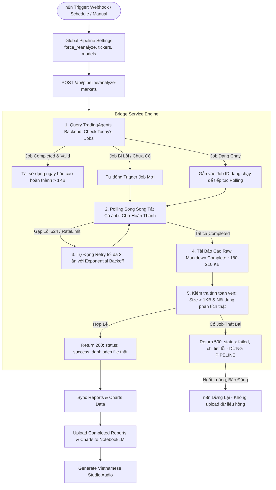

# BIÊN BẢN HỌP CHUYÊN GIA ĐA NGÀNH & KẾ HOẠCH XỬ LÝ TRIỆT ĐỂ WORKFLOW TRADING PODCAST

**Ngày thực hiện:** 24/09/2026  
**Dự án:** Trading Podcast AI Automation (TradingAgents + TradingView + Google NotebookLM)  
**Trạng thái mục tiêu:** `/goal` - Tự động hóa triệt để, kiểm thử toàn diện, không dùng dữ liệu giả, cam kết đẩy code lên GitHub.

---

## 1. THÀNH PHẦN HỘI ĐỒNG CHUYÊN GIA

1. **Chuyên gia Khắc phục & Truy vết lỗi (Bug Resolver / Root Cause Expert)**: Trưởng ban điều tra nguyên nhân cốt lõi.
2. **Chuyên gia Giải pháp (Solutions Architect)**: Thiết kế lại luồng phân tích song song, cơ chế retry thông minh và kiểm soát trạng thái.
3. **Chuyên gia Phân tích nghiệp vụ (Business Analyst)**: Giữ vững nguyên tắc cốt lõi "Chất lượng là số 1 - Tuyệt đối không sinh dữ liệu giả".
4. **Chuyên gia Phát triển phần mềm (Software Developer)**: Trực tiếp tái cấu trúc mã nguồn bridge service và client.
5. **Chuyên gia An toàn thông tin (Security Specialist)**: Kiểm tra rà quét lộ lọt thông tin, sanitization dữ liệu và credential protection.
6. **Chuyên gia Đảm bảo chất lượng (QA Specialist)**: Xây dựng kịch bản kiểm thử, nghiệm thu dữ liệu thực tế trên hệ thống.

---

## 2. KẾT QUẢ ĐIỀU TRA NGUYÊN NHÂN CỐT LÕI (ROOT CAUSE ANALYSIS)

Sau khi rà quét toàn bộ hệ sinh thái gồm `trading-podcast-bridge`, `tradingagents-backend`, `trading-podcast-n8n`, và hệ thống file trên đĩa tại `output/reports/`, Hội đồng chuyên gia đã xác định chính xác các điểm lỗi nghiêm trọng sau:

### 2.1. Lỗi Polling Timeout quá ngắn trong `bridge/main.py`
- Trong hàm `analyze_markets_endpoint` (dòng 249-261):
  ```python
  max_polls = 12
  for _ in range(max_polls):
      await asyncio.sleep(5)
      poll_res = requests.get(f"{base_url}/api/v1/jobs/{job_id}", timeout=10)
  ```
- **Tổng thời gian chờ chỉ là 60 giây (12 * 5s)**! Trong khi đó, một phiên tranh luận đa tác nhân TradingAgents (Market, Social, News, Fundamentals + 3 vòng debate + 3 vòng risk) mất từ **15 đến 22 phút** (thực tế job `DX-Y.NYB` mất 1160 giây ~ 19.3 phút).
- Hậu quả: Sau 60 giây, bridge service bỏ cuộc chờ đợi trong khi job trên TradingAgents vẫn đang chạy bình thường.

### 2.2. Lỗi Fallback sinh dữ liệu giả (Silent Dummy Data Generation) - NGUY CƠ LỚN NHẤT
- Tại dòng 273-284 của `bridge/main.py`:
  ```python
  if not collected_reports:
      for ticker in req.tickers:
          collected_reports.append({
              "ticker": ticker,
              "trade_date": today,
              "recommendation": "Quan sát kỹ thuật (Wait & Watch)",
              "executive_summary": f"Phân tích kỹ thuật và dòng tiền tổng thể cho {ticker} ngày {today}.",
              ...
          })
  ```
- Khi polling hết 60 giây mà chưa có báo cáo, biến `collected_reports` rỗng. Thay vì báo lỗi hoặc tiếp tục chờ, code **tự ý sinh ra 6 bản báo cáo giả dạng placeholder** chỉ dài 80-85 bytes:
  `Phân tích kỹ thuật và dòng tiền tổng thể cho XAUUSD ngày 2026-09-24.`
- File giả này được ghi đè vào `output/reports/TradingAgents_{ticker}_2026-09-24_Complete.md`.
- Endpoint sau đó trả về `{"status": "success", "reports_count": 6}`!

### 2.3. Lỗi n8n Workflow tiếp nhận dữ liệu rác và đẩy lên NotebookLM
- Vì bridge trả về `status: "success"`, n8n node `Analyze & Download Completed Reports` coi như thành công và lập tức chuyển tiếp đến node `Upload Completed Reports & Charts to NotebookLM`.
- NotebookLM bị nạp vào 6 file markdown "rác" chỉ vỏn vẹn 80 bytes thay vì bản phân tích chuyên sâu 180-210 KB!
- Sau đó n8n gọi tiếp node tạo Audio Podcast tiếng Việt dựa trên 6 file rác này!

### 2.4. Bỏ qua hoàn toàn các Job bị lỗi trên TradingAgents Backend
- Thực tế kiểm tra database jobs ngày `2026-09-24` trên `http://localhost:8000/api/v1/jobs`:
  - `DX-Y.NYB`: `completed` (1160.38s)
  - `^TNX`: `completed` (1131.75s)
  - `XAGUSD`: `completed`
  - `BTC-USD`: `completed`
  - `SPY`: `completed`
  - **`XAUUSD`**: `status: failed` tại progress 15% do lỗi `OpenAIAPIError: Error code: 524 - Cloudflare Proxy Read Timeout`.
- Bridge hoàn toàn không phát hiện được job `XAUUSD` bị fail, không có cơ chế retry tự động, dẫn tới việc bỏ qua hoàn toàn việc phân tích Vàng!

### 2.5. Lỗi `TypeError: expected str, bytes or os.PathLike object, not NoneType` trong `notebooklm_client.py`
- Tại dòng 328, 350, 363 của `bridge/notebooklm_client.py`:
  `Path(briefing_md_path).resolve()` được gọi mà không kiểm tra `briefing_md_path` có phải là `None` hay không. Khi chạy luồng mới nạp trực tiếp danh sách các completed report markdown mà không truyền `briefing_md_path`, hàm văng ngoại lệ `TypeError`.

---

## 3. THIẾT KẾ GIẢI PHÁP MỚI (SOLUTIONS ARCHITECTURE)



### Các nguyên tắc vàng trong giải pháp:
1. **Zero Dummy Policy**: Xóa bỏ hoàn toàn đoạn mã sinh báo cáo giả. Nếu chưa hoàn thành hoặc lỗi, trả về lỗi rõ ràng để không làm ô nhiễm NotebookLM.
2. **Smart Caching & Job Adoption**:
   - Nhận diện các job đã `completed` hôm nay: tải trực tiếp bản complete raw markdown (`/download?tab=complete`), không bắt hệ thống chạy lại từ đầu.
   - Nhận diện các job đang `running` hôm nay: nối vào theo dõi tiến trình thay vì spawn thêm job trùng lặp.
   - Nhận diện các job `failed`: tự động hủy/clear và trigger lại job mới.
3. **Adaptive Asynchronous Polling**:
   - Polling song song toàn bộ các job cần chạy (`asyncio.gather`), hỗ trợ thời gian chạy tối đa lên tới 30 phút (1800 giây) với nhịp kiểm tra 10 giây/lần.
4. **Auto-Retry on Transient Failures**:
   - Nếu gặp lỗi mạng tạm thời (như Cloudflare 524 origin timeout từ LLM gateway), tự động thử lại tối đa 2 lần.
5. **Strict Data Verification**:
   - Kiểm tra kích thước file tải về phải > 1,000 bytes (các báo cáo thực tế luôn đạt 150 - 220 KB).
6. **Defensive Fix for NotebookLM Client**:
   - Bảo vệ an toàn khi `briefing_md_path` là `None`, không gây lỗi `TypeError`.

---

## 4. MA TRẬN KẾ HOẠCH THỰC THI (ACTION PLAN)

| STT | Nhiệm vụ | File / Thành phần | Phụ trách | Trạng thái |
|---|---|---|---|---|
| 1 | Xóa bỏ đoạn mã fallback sinh fake data | `bridge/main.py` | Developer / Bug Resolver | Sẵn sàng triển khai |
| 2 | Hiện thực Smart Job Discovery, Concurrent Polling & Auto-Retry | `bridge/main.py` | Solutions Architect / Dev | Sẵn sàng triển khai |
| 3 | Sửa lỗi `Path(None)` trong `notebooklm_client.py` | `bridge/notebooklm_client.py` | Developer | Sẵn sàng triển khai |
| 4 | Cập nhật cấu hình n8n workflow (tăng timeout lên 1800s và bắt lỗi) | `n8n/workflows/trading_podcast_workflow.json` | n8n Expert / Dev | Sẵn sàng triển khai |
| 5 | Khởi động lại container bridge và chạy test thực tế ngày 24/09 | Docker / Pytest | QA Specialist | Chờ thực thi |
| 6 | Kiểm tra 6 file báo cáo trên đĩa đạt chuẩn > 150KB | `output/reports/` | QA Specialist | Chờ thực thi |
| 7 | Review an ninh, Git commit và Push mã nguồn lên GitHub | Git repo | Security / Git Manager | Chờ thực thi |
