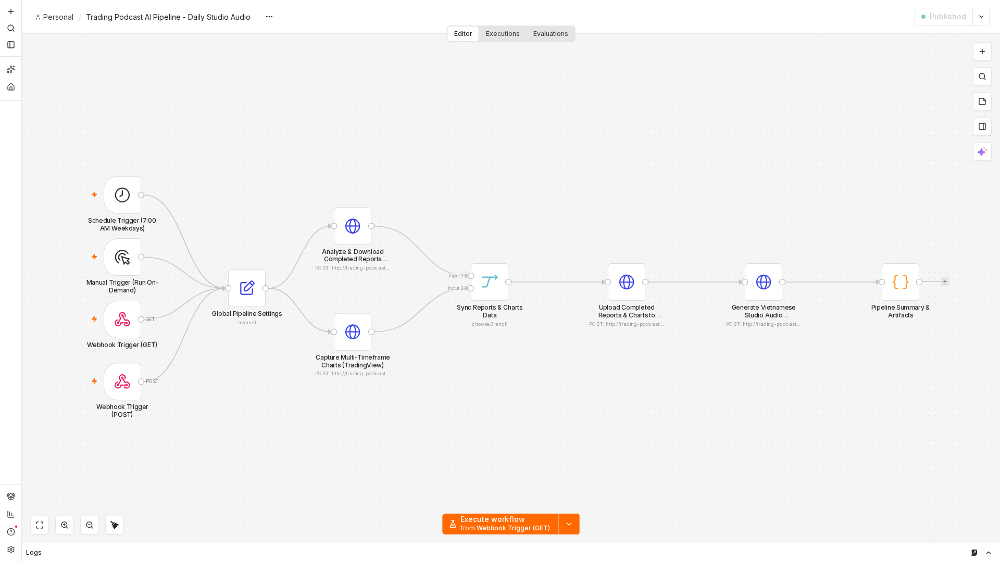
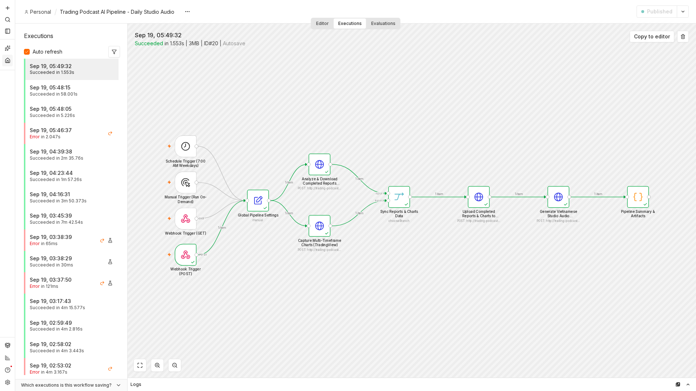
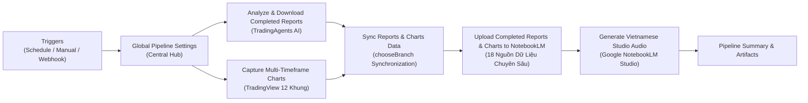

# 🎙️ Trading Podcast AI Pipeline - Daily Studio Audio

Hệ thống tự động hóa toàn diện quy trình sản xuất **Podcast Phân tích Kỹ thuật & Chiến lược Giao dịch Thị trường Tài chính chuyên sâu bằng Tiếng Việt**, điều phối thông minh qua **n8n**, kết nối trực tiếp với nền tảng trí tuệ nhân tạo **TradingAgents AI**, công cụ chụp ảnh kỹ thuật **TradingView Multi-Timeframe Capturer**, và phòng thu **Studio Audio Overview của Google NotebookLM**.

---

## 📸 Giao diện Quy trình Trực quan (Verified Architecture)

### 1. Sơ đồ luồng xử lý trên Canvas n8n (10 Nodes chuẩn mực)


### 2. Kết quả Thực thi Thực tế (Execution Succeeded 100%)


---

## 🏗️ Kiến trúc Hệ thống (Granular Multi-Source Pipeline)



### Điểm đột phá về kiến trúc dữ liệu:
* **Tải nguyên bản 100% "Completed Report" Markdown:** Thay vì tự động tóm tắt làm mất đi 95% dữ liệu quan trọng, hệ thống tự động tải trực tiếp toàn văn báo cáo phân tích hoàn chỉnh của từng mã (`XAUUSD`, `SPY`, `BTC-USD`, `XAGUSD`, `^TNX`, `DX-Y.NYB`) với dung lượng **150.000 – 215.000 ký tự mỗi mã** (tương đương khi bấm nút **Download MD** trên web frontend 5173).
* **18 nguồn tri thức nạp trực tiếp vào NotebookLM:**
  - **6 tệp Báo cáo chuyên sâu (Markdown):** Đầy đủ 4 góc nhìn phân tích (Kỹ thuật, Tâm lý, Vĩ mô, Cơ bản), trọn vẹn 3 vòng tranh biện Bull/Bear debate, và quyết định quản trị rủi ro từ Portfolio Manager.
  - **12 tệp Biểu đồ nến TradingView (PNG Dark Theme):** Đầy đủ các khung giờ từ Scalping đến Xu hướng chính (`5m`, `15m`, `1H`, `4H`, `1D`, `1W`) cho cả Vàng (`XAUUSD`) và Bạc (`XAGUSD`).
* **Hai MC AI đối thoại giàu chiều sâu:** Google NotebookLM tiếp nhận trọn vẹn 18 nguồn, giúp kịch bản thảo luận có dẫn chứng số liệu giá chính xác, nhận diện mô hình nến rõ ràng và đưa ra kế hoạch giao dịch tự tin như hai Senior Trader tại bàn Trade Desk.

---

## ⚙️ Cấu hình Tập trung tại Node `Global Pipeline Settings`

Toàn bộ thông số vận hành đều được điều phối trực tiếp tại node đầu vào **`Global Pipeline Settings`** trên n8n:

| Tham số | Kiểu dữ liệu | Giá trị khuyến nghị | Ý nghĩa nghiệp vụ |
| :--- | :--- | :--- | :--- |
| `force_reanalyze` | boolean | `false` | `false`: Tái sử dụng kết quả phân tích trong ngày chỉ mất **0.05s**; `true`: Ép AI chạy lại phiên mới |
| `force_recapture_charts` | boolean | `false` | `false`: Dùng ảnh nến đã chụp trong ngày; `true`: Mở trình duyệt chụp mới |
| `llm_provider` | string | `"openai_compatible"` | Nhà cung cấp LLM cho TradingAgents |
| `deep_think_llm` | string | `"ag/gemini-3.8-flash-high"` | Model suy luận sâu cho vòng tranh biện |
| `quick_think_llm` | string | `"ag/gemini-3.8-flash-high"` | Model suy luận nhanh cho các Analyst ban đầu |
| `max_debate_rounds` | number | `3` | Số vòng tranh biện đối kháng giữa phe Bò và phe Gấu |
| `max_risk_discuss_rounds` | number | `3` | Số vòng đánh giá của ban quản trị rủi ro |
| `output_language` | string | `"Vietnamese"` | Ngôn ngữ báo cáo đầu ra của AI |
| `tickers` | array | `["XAUUSD", "SPY", "BTC-USD", "XAGUSD", "^TNX", "DX-Y.NYB"]` | Danh mục 6 tài sản phân tích vĩ mô & kim loại |
| `chart_symbols` | array | `["XAUUSD", "XAGUSD"]` | Cặp biểu đồ nến cần chụp |
| `chart_intervals` | array | `["5", "15", "60", "240", "D", "W"]` | 6 khung thời gian kỹ thuật |
| `podcast_prompt` | string | Kịch bản 4 phần | Chỉ đạo 2 MC dẫn dắt tập trung vào Vàng/Bạc, Vĩ mô DXY/TNX, Luân chuyển rủi ro, và Kế hoạch vào lệnh |

---

## 🚀 Hướng dẫn Cài đặt & Khởi chạy (Setup Guide)

### 1. Yêu cầu Tiên quyết
* Hệ điều hành Linux / macOS / Windows WSL2 có cài sẵn Docker & Docker Compose.
* Đã clone và khởi động hệ thống [TradingAgents](https://github.com/thieucong98/TradingAgents) tại cổng `8000` và `5173`.

### 2. Thiết lập Môi trường & Bảo mật Cookie NotebookLM
1. Tạo file môi trường từ mẫu:
   ```bash
   cp .env.example .env
   ```
2. Cấu hình xác thực Google NotebookLM:
   - Hệ thống giao tiếp an toàn với Google NotebookLM qua phiên làm việc Playwright cookies.
   - Sao chép file mẫu:
     ```bash
     cp storage_state.example.json storage_state.json
     ```
   - Đăng nhập tài khoản Google trên trình duyệt Chrome, sử dụng tiện ích xuất cookie (như *Get cookies.txt LOCALLY*) hoặc dùng lệnh `notebooklm login` để cập nhật cookie hợp lệ vào `storage_state.json`.
   > ⚠️ **Lưu ý Bảo mật:** File `storage_state.json` và `.env` đã được đưa vào `.gitignore` để đảm bảo **tuyệt đối không bị rò rỉ cookie hoặc thông tin xác thực** lên GitHub.

### 3. Khởi chạy Dịch vụ với Docker Compose
```bash
docker compose up -d --build
```
Kiểm tra sức khỏe dịch vụ:
```bash
curl -s http://localhost:8010/health
```
Kết quả trả về hợp lệ:
```json
{
  "status": "healthy",
  "service": "Trading Podcast Bridge",
  "notebooklm_authenticated": true,
  "storage_state_path": "/app/storage_state.json",
  "output_dir": "/app/output"
}
```

### 4. Truy cập n8n & Kích hoạt Pipeline
* Mở trình duyệt: **[http://localhost:5678](http://localhost:5678)**
* Đăng nhập:
  - Thiết lập tài khoản admin ban đầu khi mở n8n hoặc cấu hình qua biến môi trường `N8N_ADMIN_EMAIL` và `N8N_ADMIN_PASSWORD` trong file `.env`.
* Workflow **`Trading Podcast AI Pipeline - Daily Studio Audio`** đã được cấu hình sẵn và kích hoạt (Active / Published).

### 5. Kích hoạt Thực thi & Tùy biến Tham số Từ Xa (Remote Webhook Parameters)
Hệ thống hỗ trợ kích hoạt linh hoạt qua cả **GET (Query Parameters)** và **POST (JSON Body)**. Mặc định mọi cờ ép chạy lại đều là `false` để tận dụng bộ nhớ đệm tốc độ cao (0.5s), nhưng bạn có thể truyền tham số để ghi đè từ xa mà không cần truy cập vào giao diện n8n:

* **Kích hoạt mặc định (Dùng cache nếu đã phân tích trong ngày):**
  ```bash
  curl -s http://localhost:5678/webhook/run-trading-podcast
  ```

* **Ép chụp lại mới toàn bộ 12 khung biểu đồ nến kỹ thuật (`force_recapture=true`):**
  ```bash
  # Qua GET query string:
  curl -s "http://localhost:5678/webhook/run-trading-podcast?force_recapture=true"

  # Hoặc qua POST JSON body:
  curl -s -X POST "http://localhost:5678/webhook/run-trading-podcast" \
    -H "Content-Type: application/json" \
    -d '{"force_recapture": true}'
  ```

* **Ép AI TradingAgents phân tích lại phiên mới (`force_reanalyze=true`):**
  ```bash
  curl -s "http://localhost:5678/webhook/run-trading-podcast?force_reanalyze=true"
  ```

* **Ép làm mới toàn diện cả Báo cáo Phân tích và Biểu đồ nến:**
  ```bash
  curl -s -X POST "http://localhost:5678/webhook/run-trading-podcast" \
    -H "Content-Type: application/json" \
    -d '{"force_reanalyze": true, "force_recapture": true}'
  ```

* **Kiểm thử trên giao diện n8n Test URL (`webhook-test`):**
  Khi đang mở giao diện n8n và bấm *"Listen for test event"*, bạn có thể kiểm thử bằng đường dẫn:
  ```bash
  curl -s "http://localhost:5678/webhook-test/run-trading-podcast?force_recapture=true"
  ```

* **Bảng bí danh tham số (Aliases hỗ trợ):**
  - Ép phân tích: `force_reanalyze`, `force_analysis`, `reanalyze`, `forceReanalyze` (chấp nhận `true`, `1`, `"true"`).
  - Ép chụp nến: `force_recapture_charts`, `force_recapture`, `force_capture`, `recapture` (chấp nhận `true`, `1`, `"true"`).
  - Tùy chỉnh model từ xa: `llm_provider`, `deep_think_llm`, `quick_think_llm`, `tickers`...

---

## 📂 Quản lý Tệp Đầu Ra (Outputs)

Sau mỗi phiên chạy, các tệp tài nguyên được lưu trữ tại thư mục `output/`:
* **Báo cáo phân tích hoàn chỉnh:** `output/reports/`
  - `TradingAgents_XAUUSD_YYYY-MM-DD_Complete.md` (~190 KB)
  - `TradingAgents_XAGUSD_YYYY-MM-DD_Complete.md` (~178 KB)
  - `TradingAgents_BTC-USD_YYYY-MM-DD_Complete.md` (~211 KB)
  - `TradingAgents_SPY_YYYY-MM-DD_Complete.md` (~191 KB)
  - `TradingAgents_TNX_YYYY-MM-DD_Complete.md` (~188 KB)
  - `TradingAgents_DX-Y.NYB_YYYY-MM-DD_Complete.md` (~180 KB)
* **Biểu đồ nến TradingView Dark Theme:** `output/charts/`
  - `XAUUSD_5m.png`, `XAUUSD_15m.png`, `XAUUSD_1H.png`, `XAUUSD_4H.png`, `XAUUSD_1D.png`, `XAUUSD_1W.png`
  - `XAGUSD_5m.png`, `XAGUSD_15m.png`, `XAGUSD_1H.png`, `XAGUSD_4H.png`, `XAGUSD_1D.png`, `XAGUSD_1W.png`
* **Podcast Audio phòng thu hoàn chỉnh:** `output/podcasts/`
  - Tệp âm thanh MP3 đối thoại 2 người dẫn tiếng Việt (~21 MB) kết xuất từ Google NotebookLM Studio.

---

## 📡 API Endpoints (Trading Podcast Bridge Service :8010)

| Endpoint | Phương thức | Mô tả chức năng |
| :--- | :---: | :--- |
| `/health` | `GET` | Kiểm tra trạng thái hoạt động và xác thực NotebookLM |
| `/api/pipeline/analyze-markets` | `POST` | Thực thi/tải 6 tệp Completed Report Markdown từ TradingAgents |
| `/api/charts/capture` | `POST` | Chụp tự động 12 khung biểu đồ nến TradingView Headless |
| `/api/notebooklm/upload-sources` | `POST` | Nạp trực tiếp toàn bộ 18 nguồn lên Google NotebookLM |
| `/api/notebooklm/generate-podcast` | `POST` | Kích hoạt Studio tạo Audio Overview tiếng Việt theo prompt |
| `/api/download/chart/{filename}` | `GET` | Tải xuống ảnh biểu đồ nến kỹ thuật |
| `/api/download/report/{filename}` | `GET` | Tải xuống báo cáo Markdown hoàn chỉnh |

---

## 🛡️ Tiêu Chuẩn Bảo Mật & Đóng Gói (Security Audit)
* **Không lưu trữ Secret/Token trong mã nguồn:** Tất cả mật khẩu, khóa bí mật, cookie phiên được quản lý tách biệt qua file `.env` và `storage_state.json`.
* **Quy tắc `.gitignore` nghiêm ngặt:** Chặn hoàn toàn việc commit các tệp cookie, binary MP3 lớn, hoặc dữ liệu nhạy cảm lên Git.
* **Cơ chế Idempotency & Tự phục hồi:** Tự động sửa lỗi cấu trúc cookie Google nếu người dùng xuất định dạng mảng thuần túy thành chuẩn Playwright Storage State.

---

## 👨‍💻 Tác Giả & Bản Quyền
Phát triển bởi **Thieu Cong** ([@thieucong98](https://github.com/thieucong98)).
Được xây dựng phục vụ cộng đồng giao dịch và đầu tư tài chính chuyên nghiệp.
