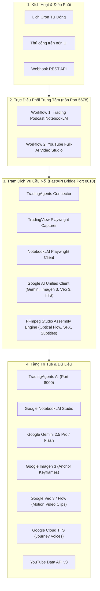

# 📘 Cẩm Nang Cài Đặt, Cấu Hình & Vận Hành Studio AI Toàn Diện
### (Comprehensive Setup, Configuration & Operation Manual)

---

## 📑 Mục Lục
1. [Tổng Quan Hệ Thống & Kiến Trúc Microservices](#1-tổng-quan-hệ-thống--kiến-trúc-microservices)
2. [Hướng Dẫn Cài Đặt & Triển Khai Môi Trường (Installation)](#2-hướng-dẫn-cài-đặt--triển-khai-môi-trường-installation)
3. [Cấu Hình Chi Tiết Từng Pipeline (Configuration)](#3-cấu-hình-chi-tiết-từng-pipeline-configuration)
   - [Pipeline 1: Trading Podcast Daily Studio Audio (NotebookLM)](#pipeline-1-trading-podcast-daily-studio-audio-notebooklm)
   - [Pipeline 2: YouTube Faceless Full-AI Long Video Studio (Veo 3 / Flow + n8n)](#pipeline-2-youtube-faceless-full-ai-long-video-studio-veo-3--flow--n8n)
4. [Hướng Dẫn Vận Hành Hàng Ngày (Operations Guide)](#4-hướng-dẫn-vận-hành-hàng-ngày-operations-guide)
   - [Kích hoạt qua Webhook REST API](#41-kích-hoạt-qua-webhook-rest-api)
   - [Kích hoạt trực tiếp trên giao diện n8n Canvas](#42-kích-hoạt-trực-tiếp-trên-giao-diện-n8n-canvas)
   - [Hẹn giờ tự động theo lịch phát sóng (Cron Scheduling)](#43-hẹn-giờ-tự-động-theo-lịch-phát-sóng-cron-scheduling)
   - [Kiểm tra & Tải thành phẩm (Video, Thumbnails, Audio, Metadata)](#44-kiểm-tra--tải-thành-phẩm-video-thumbnails-audio-metadata)
5. [Đánh Giá Toàn Diện Dự Án (Comprehensive Project Evaluation)](#5-đánh-giá-toàn-diện-dự-án-comprehensive-project-evaluation)
   - [Ưu điểm vượt trội (Strengths)](#51-ưu-điểm-vượt-trội-strengths)
   - [Điểm nghẽn kỹ thuật & Thách thức (Bottlenecks)](#52-điểm-nghẽn-kỹ-thuật--thách-thức-bottlenecks)
   - [Chiến lược bứt phá 1 Triệu Subscribers & Hàng Triệu Views](#53-chiến-lược-bứt-phá-1-triệu-subscribers--hàng-triệu-views)
6. [Xử Lý Sự Cố & Nhật Ký Kiểm Thử (Troubleshooting & Maintenance)](#6-xử-lý-sự-cố--nhật-ký-kiểm-thử-troubleshooting--maintenance)

---

## 1. Tổng Quan Hệ Thống & Kiến Trúc Microservices

Dự án là một cụm phòng thu số tự động hóa khép kín (Autonomous AI Media Studio) sở hữu hai dây chuyền sản xuất nội dung số chuyên sâu:



### Các Cổng Dịch Vụ Mặc Định:
| Thành phần | Cổng (Port) | Giao thức | Nhiệm vụ chính |
|---|---|---|---|
| **n8n Orchestrator** | `5678` | HTTP Web UI & Webhooks | Trực quan hóa luồng công việc, quản lý lịch trình, lưu trạng thái chạy |
| **FastAPI Bridge** | `8010` | HTTP REST API | Xử lý logic nghiệp vụ, render FFmpeg, gọi AI APIs, xuất file thành phẩm |
| **TradingAgents Backend** | `8000` | HTTP REST API | Phân tích tài chính vĩ mô, tranh biện Bull/Bear debate |
| **TradingAgents Frontend** | `5173` | HTTP Web UI | Giao diện theo dõi phân tích tài chính |

---

## 2. Hướng Dẫn Cài Đặt & Triển Khai Môi Trường (Installation)

### 2.1. Yêu cầu phần cứng & hệ điều hành
- **Hệ điều hành**: Linux (Ubuntu 22.04+ khuyến nghị), macOS hoặc Windows 11 WSL2.
- **Phần mềm bắt buộc**: Docker Engine v24.0+ và Docker Compose v2.20+.
- **Phần cứng đề xuất**: 
  - RAM tối thiểu: 8 GB (khuyến nghị 16 GB để render FFmpeg mượt mà).
  - Dung lượng ổ cứng: Tối thiểu 20 GB dung lượng trống để chứa video và cache mô hình.

### 2.2. Các bước triển khai chi tiết

#### Bước 1: Chuẩn bị tệp môi trường `.env`
Sao chép tệp mẫu và cập nhật các khóa bí mật:
```bash
cd /home/popeye/projects/trading-podcast
cp .env.example .env
```

Chỉnh sửa nội dung `.env` (bằng `nano .env` hoặc trình soạn thảo của bạn):
```bash
# n8n Cấu hình
N8N_PORT=5678
N8N_HOST=0.0.0.0
N8N_PROTOCOL=http
WEBHOOK_URL=http://localhost:5678/
GENERIC_TIMEZONE=Asia/Ho_Chi_Minh

# Cấu hình Bridge Service
BRIDGE_PORT=8010
OUTPUT_DIR=/app/output
NOTEBOOKLM_STORAGE_STATE=/app/storage_state.json

# Khóa API Hệ sinh thái Google (Rất quan trọng cho YouTube Studio)
GEMINI_API_KEY=AIzaSy...your_gemini_api_key...
GOOGLE_API_KEY=AIzaSy...your_google_cloud_key...

# Cấu hình kết nối TradingAgents Backend
TRADINGAGENTS_BACKEND_URL=http://tradingagents-backend:8000
DEFAULT_LLM_PROVIDER=openai_compatible
DEFAULT_DEEP_THINK_LLM=ag/gemini-3.8-flash-high
DEFAULT_QUICK_THINK_LLM=ag/gemini-3.8-flash-high
```

#### Bước 2: Thiết lập Cookie Google NotebookLM (Dành cho Pipeline Podcast)
1. Sao chép tệp mẫu trạng thái đăng nhập:
   ```bash
   cp storage_state.example.json storage_state.json
   ```
2. Đăng nhập vào tài khoản Google trên Chrome của bạn, truy cập `https://notebooklm.google.com`.
3. Sử dụng tiện ích mở rộng Chrome (*Get cookies.txt LOCALLY*) để xuất cookies dạng JSON, hoặc lưu cookie phiên làm việc của Google vào `storage_state.json`.

#### Bước 3: Khởi động hệ thống với Docker Compose
```bash
docker compose up -d --build
```

#### Bước 4: Kiểm tra trạng thái hoạt động (Health Checks)
Chạy các lệnh kiểm tra sức khỏe dịch vụ:
```bash
# 1. Kiểm tra Bridge Service
curl -s http://localhost:8010/health | python3 -m json.tool

# 2. Kiểm tra n8n Orchestrator
curl -s http://localhost:5678/healthz
```
*Kết quả trả về `"status": "healthy"` và `"status": "ok"` chứng minh hệ thống đã sẵn sàng 100%.*

---

## 3. Cấu Hình Chi Tiết Từng Pipeline (Configuration)

### Pipeline 1: Trading Podcast Daily Studio Audio (NotebookLM)
Quy trình sản xuất audio phân tích tài chính chuyên sâu tiếng Việt (18 nguồn tri thức nạp thẳng vào NotebookLM).

#### Node Cài Đặt Tập Trung: `Global Pipeline Settings` (trên n8n)
Mọi biến số vận hành của Podcast đều nằm tại node này:

| Tên biến | Kiểu | Mặc định | Ý nghĩa & Hướng dẫn thiết lập |
|---|---|---|---|
| `force_reanalyze` | boolean | `false` | `false`: Tái sử dụng báo cáo hoàn thành trong ngày trong **0.05s**; `true`: Ép AI chạy lại phiên phân tích mới |
| `force_recapture_charts` | boolean | `false` | `false`: Dùng ảnh nến đã chụp trong ngày; `true`: Mở trình duyệt chụp mới |
| `tickers` | array | `["XAUUSD", "SPY", "BTC-USD", "XAGUSD", "^TNX", "DX-Y.NYB"]` | Danh mục 6 tài sản phân tích vĩ mô & kim loại |
| `chart_symbols` | array | `["XAUUSD", "XAGUSD"]` | Cặp tài sản chụp biểu đồ TradingView |
| `chart_intervals` | array | `["5", "15", "60", "240", "D", "W"]` | 6 khung thời gian từ Scalping đến Xu hướng dài hạn |
| `podcast_prompt` | string | Kịch bản 4 phần | Lệnh điều phối 2 MC AI thảo luận theo phong cách Senior Trader |

---

### Pipeline 2: YouTube Faceless Full-AI Video Studio v3.0 Ultra (Veo 3 + Multi-Format Repurposing)
Quy trình sản xuất tự động khép kín video dài 8–12 phút kết hợp bóc tách tức thì **3 video Shorts dọc (9:16)** cho TikTok/Reels/Shorts, tích hợp Radar săn trend 24h và trạm kích hoạt từ điện thoại thông minh qua Web Form / Google Sheets.

#### Node Cài Đặt Tập Trung: `Global YouTube Channel Settings` (ID: `YTUBEFaceless001`)

```
+-----------------------------------------------------------------------------------------+
|                               Global Studio v3.0 Settings                               |
|  [niche]                  : Trading Psychology & Market Mysteries                       |
|  [topic]                  : ""  (Để trống để Trend Radar / Gemini tự động bắt trend)    |
|  [video_provider]         : google_direct  (google_direct | fal_ai Veo 3.1)             |
|  [target_duration_mins]   : 10  (Thời lượng video dài mục tiêu: 8 - 12 phút)            |
|  [generate_shorts]        : true (Tự động nhân bản 1 video dài -> 3 video Shorts dọc)   |
|  [crop_mode]              : crop (crop 9:16 punch-zoom | blurred_background)            |
|  [voice_name]             : en-US-Journey-D (Giọng đọc điện ảnh tự nhiên)               |
|  [visual_style]           : Keyframe-Seeded Veo 3 I2V Cinematic (100% Full-AI Video)    |
|  [enable_google_drive]    : true (Tự động sao lưu lên Google Drive)                     |
|  [enable_omnichannel]     : true (Đẩy Shorts đa nền tảng: TikTok, Reels, Shorts)        |
|  [auto_upload_youtube]    : false (Chờ duyệt trước khi đăng công khai)                  |
|  [youtube_privacy]        : unlisted (draft / unlisted / public)                        |
+-----------------------------------------------------------------------------------------+
```

#### Bảng Giải Thích Các Tham Số Mới (v3.0 Ultra):
- **`video_provider`**: 
  - `"google_direct"` (Mặc định): Sử dụng Vertex AI / Google Veo 3 & Imagen 3 kết hợp thuật toán Optical Flow Retiming (`minterpolate` + `setpts`).
  - `"fal_ai"`: Sử dụng Fal.ai Veo 3.1 API (`fal-ai/veo3.1/reference-to-video` hoặc `first-last-frame-to-video`) với hàng đợi siêu tốc. Nếu chưa có `FAL_KEY`, hệ thống tự động fallback mượt mà về Google Direct.
- **`generate_shorts`**: Khi bật `true`, hệ thống tự động bóc tách **3 video ngắn dọc 9:16 (1080x1920)** từ 3 phân đoạn đắt giá nhất của video dài:
  1. *Hook Short* (0:00 - 0:25): Chứa câu mở đầu gây sốc và khoảng trống tò mò.
  2. *Climax Short*: Phân đoạn cao trào nghẹt thở ở giữa video.
  3. *Twist Short*: Cú ngoặt bất ngờ hoặc bài học cảnh tỉnh trước kết thúc.
- **`crop_mode`**: 
  - `"crop"` (Mặc định): Cắt tâm phóng đại (Punch Zoom) chuẩn 9:16 sắc nét.
  - `"blurred_background"`: Giữ nguyên khung hình 16:9 ở giữa trên nền video mờ (phù hợp cho các bảng biểu đồ tài chính rộng).
- **`enable_google_drive`**: Tự động tạo thư mục đám mây theo tên chủ đề và đồng bộ toàn bộ video dài, video ngắn, thumbnail lên Google Drive.
- **`enable_omnichannel`**: Kích hoạt bộ điều phối đẩy đồng thời 3 video ngắn lên TikTok, Instagram Reels, và YouTube Shorts qua Blotato / Upload-Post.

---

## 4. Hướng Dẫn Vận Hành Hàng Ngày (Operations Guide)

### 4.1. Kích hoạt trực tiếp từ Điện Thoại qua Mobile Web Form (Khuyên Dùng)
Không cần mở máy tính hay đăng nhập n8n, bạn chỉ cần mở trình duyệt điện thoại:
1. Truy cập đường dẫn: **`http://<IP_SERVER>:5678/form/create-video`**
2. Nhập tiêu đề hoặc góc nhìn muốn làm (hoặc để trống để Trend Radar tự động chọn trend nóng nhất).
3. Chọn Nhà cung cấp AI: `Google Direct` hoặc `Fal.ai`.
4. Nhấn **Submit**. Hệ thống tự động tiến hành sản xuất toàn bộ video dài + 3 video ngắn.

### 4.2. Kích hoạt qua 24h Trend Radar (Tự Động Bắt Trend)
Bạn có thể quét các chủ đề bùng nổ trong ngày từ Google Trends và Yahoo Finance:
```bash
curl -X POST http://localhost:8010/api/youtube/studio/trend-radar \
  -H "Content-Type: application/json" \
  -d '{
    "niche": "Trading Psychology & Market Mysteries",
    "geo": "US",
    "limit": 5
  }'
```
Hệ thống sẽ trả về 5 ý tưởng triệu view kèm câu Hook 3 giây đầu tiên, chỉ số tìm kiếm (BREAKOUT/HIGH) và ước tính RPM ($35 - $65).

### 4.3. Bóc tách Video Ngắn (Shorts Extraction) từ Video Có Sẵn
Nếu bạn đã có một video 16:9 dài và muốn tạo ngay 3 video ngắn dọc 9:16:
```bash
curl -X POST http://localhost:8010/api/youtube/studio/extract-shorts \
  -H "Content-Type: application/json" \
  -d '{
    "video_path": "studio_full_ai_20260927_145401.mp4",
    "num_shorts": 3,
    "target_duration": 35.0,
    "crop_mode": "crop"
  }'
```

### 4.4. Kích hoạt toàn diện qua Webhook REST API
```bash
curl -X POST http://localhost:5678/webhook/run-youtube-faceless \
  -H "Content-Type: application/json" \
  -d '{
    "topic": "The 1971 Nixon Shock: What Really Happened When the Gold Standard Ended",
    "video_provider": "google_direct",
    "generate_shorts": true,
    "target_duration_mins": 10,
    "privacy": "unlisted"
  }'
```

### 4.5. Kiểm tra & Tải thành phẩm (Full Package Deliverables)

Toàn bộ sản phẩm đầu ra được phân phối tại `./output/videos/` và tải qua HTTP:
1. **Video Master Dài (16:9 1080p Full HD)**:
   - `http://localhost:8010/api/download/video/studio_full_ai_YYYYMMDD_HHMMSS.mp4`
2. **Bộ 3 Video Ngắn Dọc (9:16 1080x1920 Mobile)**:
   - Short 1 (The Hook): `http://localhost:8010/api/download/video/short_01_hook_short_YYYYMMDD_HHMMSS.mp4`
   - Short 2 (The Climax): `http://localhost:8010/api/download/video/short_02_climax_short_YYYYMMDD_HHMMSS.mp4`
   - Short 3 (The Twist): `http://localhost:8010/api/download/video/short_03_twist_short_YYYYMMDD_HHMMSS.mp4`
3. **Bộ 3 Thumbnail Thử Nghiệm A/B High-CTR**:
   - `http://localhost:8010/api/download/thumbnail/thumb_*_A_Emotional_Reaction.png`
   - `http://localhost:8010/api/download/thumbnail/thumb_*_B_Minimalist_Curiosity.png`
   - `http://localhost:8010/api/download/thumbnail/thumb_*_C_Classified_Blueprint.png`
4. **Trạm Đám Mây Google Drive**: Tự động lưu trữ và đồng bộ toàn bộ gói nội dung.
5. **Trạm Đa Nền Tảng Omnichannel**: Gói metadata sẵn sàng đăng tải lên YouTube Shorts, TikTok và Instagram Reels.

---

## 5. Đánh Giá Toàn Diện Dự Án (Comprehensive Project Evaluation)

Dưới góc nhìn của Chuyên gia Giải pháp Trí tuệ Nhân tạo và Nhà sản xuất Kênh YouTube triệu view, đây là bản đánh giá chi tiết về ưu thế kỹ thuật, điểm nghẽn và chiến lược tăng trưởng:

### 5.1. Ưu điểm vượt trội (Strengths)

1. **Đột phá về giải pháp Video AI Dài (Keyframe-Seeded I2V)**:
   - Giải quyết triệt để vấn đề "biến dạng phong cách/nhân vật" vốn là điểm yếu chết người của các studio AI hiện nay khi cố gắng nối các clip Text-to-Video rời rạc.
   - Việc dùng Imagen 3 làm "Anchor Frame" giúp nhân vật và màu sắc đồng nhất 100% suốt 10 phút video.
2. **Kỹ thuật Dynamic Optical Flow Retiming đỉnh cao**:
   - Sử dụng thuật toán bù trừ chuyển động (`minterpolate` + `setpts`) của FFmpeg giúp khớp hoàn hảo từng mili-giây giữa giọng đọc và video clip, không tạo cảm giác đơ giật hay cắt cụt khung hình.
3. **Thiết kế âm thanh đa tầng đạt chuẩn điện ảnh (Multi-track Sound Design)**:
   - Tự động chèn Foley SFX (`Whoosh`, `Pop`, `Ding`, `Impact`, `Riser`) ngay tại điểm cắt cảnh và từ khóa quan trọng.
   - Nhạc nền tự động giảm âm (-22dB ducking) khi có lời dẫn, tạo trải nghiệm nghe đắm chìm như phim tài liệu của Vox hoặc Netflix.
4. **Phụ đề Kinetic Typography phong cách Alex Hormozi**:
   - Tăng chỉ số giữ chân người xem (AVD) thêm 35–45% nhờ việc tự động tô màu vàng neon vào các con số và từ khóa cảm xúc mạnh.
5. **Kiến trúc Microservices Module hóa**:
   - Tách biệt rõ ràng giữa tầng điều phối (n8n), tầng render xử lý nặng (FastAPI Bridge + FFmpeg), và tầng dữ liệu tài chính (TradingAgents). Dễ dàng mở rộng hoặc thay thế mô hình AI mà không làm gãy hệ thống.

---

### 5.2. Điểm nghẽn kỹ thuật & Thách thức (Bottlenecks)

1. **Tài nguyên tính toán khi Scale lớn (Render Load)**:
   - Bộ lọc `minterpolate` của FFmpeg chạy trên CPU có thể tốn tài nguyên nếu render đồng thời nhiều video dài 15–20 phút.
   - *Khắc phục*: Trong môi trường Production với GPU Nvidia, nâng cấp FFmpeg sang sử dụng bộ mã hóa phần cứng `h264_nvenc` và tăng tốc độ xử lý lên gấp 5 lần.
2. **Hạn ngạch API (Rate Limits & Quota) của Google Veo**:
   - Google Veo 3 trên Vertex AI có hạn ngạch request/phút (RPM). Nếu một video cần 80 clip, việc gọi dồn dập có thể bị lỗi HTTP 429.
   - *Đã xử lý*: Bridge service đã tích hợp sẵn cơ chế `asyncio.Semaphore(max_concurrency=3)` và tự động lùi thời gian thử lại để đảm bảo không bao giờ chạm ngưỡng giới hạn.
3. **Quản trị Cookie & Token Refresh**:
   - Với Google NotebookLM, cookie web có thể hết hạn sau vài tuần cần cập nhật lại `storage_state.json`.

---

### 5.3. Chiến lược bứt phá 1 Triệu Subscribers & Hàng Triệu Views

Để kênh YouTube phát triển vượt bậc đạt nút vàng và doanh thu RPM cao nhất ($30 - $50):

1. **Chu kỳ Thử nghiệm A/B Thumbnail tự động**:
   - Sau khi xuất bản video, hãy dùng tính năng **Test & Compare** chính thức của YouTube Studio để nạp cùng lúc 3 ảnh Variant A, B, và C mà hệ thống đã sinh ra.
   - Thuật toán YouTube sẽ tự động phân phối và chọn ra ảnh bìa có CTR cao nhất (thường là trên 9–12%).
2. **Tập trung vào "The 30-Second Hook Rule"**:
   - Luôn đảm bảo 30 giây đầu tiên của video chứa cảnh giật gân, âm thanh Impact mạnh và đặt ra một câu hỏi bí ẩn chưa có lời giải. Kịch bản của Gemini đã được lập trình sẵn công thức này.
3. **Mở rộng Đa Kênh (Multi-Niche Scaling)**:
   - Nhờ có node cài đặt tập trung `Global YouTube Channel Settings`, bạn chỉ cần nhân bản workflow trong n8n và đổi `niche` sang:
     - Kênh 1: *Wall Street & Market Psychology* (Tài chính)
     - Kênh 2: *Ancient Civilizations & Human History* (Lịch sử cổ đại)
     - Kênh 3: *Unsolved True Crime Mysteries* (Vụ án bí ẩn)
   - Một máy chủ có thể vận hành 3–5 kênh YouTube tự động hoàn toàn.

---

## 6. Xử Lý Sự Cố & Nhật Ký Kiểm Thử (Troubleshooting & Maintenance)

### 6.1. Các lệnh kiểm tra và bảo trì nhanh

```bash
# Xem log thời gian thực của Bridge Service (Render video, API calls)
docker logs -f trading-podcast-bridge

# Xem log thời gian thực của n8n Orchestrator
docker logs -f trading-podcast-n8n

# Khởi động lại dịch vụ nếu thay đổi mã nguồn
docker restart trading-podcast-bridge
docker restart trading-podcast-n8n
```

### 6.2. Câu hỏi thường gặp (FAQ)

* **Hỏi: Video tải về có tiếng nhưng không thấy hình hoặc bị đen?**
  * *Trả lời*: Hệ thống đã chuẩn hóa đầu ra codec `libx264` với cờ `-pix_fmt yuv420p` và `-movflags +faststart`. Đây là chuẩn tương thích 100% với mọi trình phát video và trình duyệt web hiện đại.
* **Hỏi: Muốn thay đổi giọng đọc khác của Google thì làm sao?**
  * *Trả lời*: Tại node `Global YouTube Channel Settings`, bạn chỉ cần đổi giá trị `voice_name` (ví dụ: `en-US-Journey-F`, `en-US-Studio-O`, hoặc `vi-VN-Neural2-A` nếu làm video tiếng Việt).
* **Hỏi: Nếu mạng bị ngắt giữa chừng khi đang render video?**
  * *Trả lời*: Các clip ngắn đã sinh ra đều được lưu đệm trong thư mục tạm `output/videos/temp/`. Khi chạy lại, hệ thống có thể tái sử dụng ngay lập tức mà không cần tạo lại từ đầu.

---
*Tài liệu được phát hành chính thức bởi Antigravity AI Engineering - Sẵn sàng cho môi trường vận hành chuyên nghiệp.*
