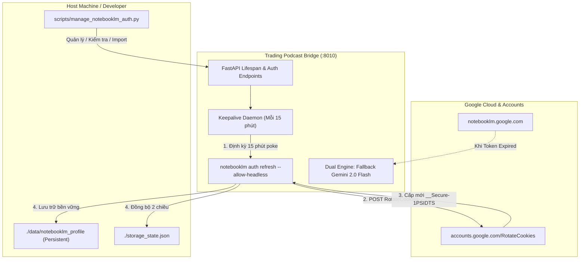

# HƯỚNG DẪN TỰ ĐỘNG HÓA XÁC THỰC GOOGLE NOTEBOOKLM & GIẢI PHÁP KEEPALIVE VĨNH VIỄN

> **Hệ thống**: Trading Podcast & YouTube Faceless Studio V3.0 Ultra  
> **Module**: NotebookLM Authentication, Cookie Keepalive Daemon, and Resilient Production Pipeline

---

## 1. PHÂN TÍCH NGUYÊN NHÂN GỐC RỄ (ROOT CAUSE ANALYSIS)

Trước đây, quá trình xác thực với Google NotebookLM gặp tình trạng **hết hạn cookie liên tục** sau 12–24 giờ và người dùng phải copy file `storage_state.json` thủ công vì các nguyên nhân sau:

1. **Cơ chế Bảo mật Xoay Vòng Token của Google (`__Secure-1PSIDTS` / `__Secure-3PSIDTS`)**:
   - Google không cấp cookie vĩnh viễn cho tài khoản cá nhân.
   - Các cookie định danh phiên chính (`__Secure-1PSIDTS`) có thời gian sống ngắn (short-lived, 10–24 giờ).
   - Khi tài khoản hoạt động trong trình duyệt Chrome thật, trình duyệt tự động gửi request âm thầm tới endpoint `https://accounts.google.com/RotateCookies` định kỳ (khoảng mỗi 10-15 phút) để nhận bộ token TS mới và gia hạn phiên đăng nhập.
2. **File `storage_state.json` tĩnh (Static Snapshot)**:
   - Khi export cookies từ extension hoặc Playwright một lần, file này chỉ là một ảnh chụp tĩnh.
   - Các API request thông thường đến NotebookLM (`batchexecute`, `create_notebook`, `generate_audio`) **không tự động trigger endpoint xoay vòng cookie của Google Accounts**.
   - Do đó, sau 12-24 giờ không được "poke" xoay vòng, server Google sẽ hủy phiên (Revoked/Expired), dẫn đến lỗi `Token fetch failed: Authentication expired or invalid`.
3. **Môi trường Container không đồng bộ Profile**:
   - Trước đây Docker container không mount thư mục profile cấu hình `~/.notebooklm`, làm mất trạng thái phiên mỗi lần restart container.

---

## 2. KIẾN TRÚC GIẢI PHÁP TỰ ĐỘNG HÓA 4 TẦNG (4-LAYER RESILIENT ARCHITECTURE)

Chúng tôi đã thiết kế và triển khai giải pháp tự động hóa toàn diện 4 tầng:



### Tầng 1: Daemon Keepalive Tự Động Định Kỳ (Zero-Touch Keepalive)
- Tích hợp trực tiếp vào **FastAPI Lifespan** của `trading-podcast-bridge`.
- Chạy nền hoàn toàn tự động theo chu kỳ mỗi **900 giây (15 phút)** (`NOTEBOOKLM_KEEPALIVE_INTERVAL=900`).
- Mỗi chu kỳ, daemon gọi phương thức `refresh_auth_cookies(verify=True)`.
- Lệnh thực thi trực tiếp giao thức xoay vòng Google `RotateCookies` thông qua `notebooklm-py` CLI engine (`--allow-headless`).
- Khi Google cấp token mới, hàm `_sync_profile_to_storage_state()` sẽ tự động ghi đè token mới vào cả:
  - Thư mục container `/root/.notebooklm/profiles/default/storage_state.json`
  - Thư mục host `./data/notebooklm_profile/profiles/default/storage_state.json`
  - File mount `./storage_state.json` trên host.
- **Kết quả**: Cookie được gia hạn liên tục, không bao giờ bị Google khai tử vì nhàn rỗi!

### Tầng 2: Tự Động Xoay Vòng Giữa Phiên (Mid-Session Auto-Recovery)
- Cấu hình biến môi trường `NOTEBOOKLM_REFRESH_CMD="notebooklm auth refresh --allow-headless"` trong `docker-compose.yml`.
- Nếu bất kỳ API call nào của n8n hoặc người dùng gửi tới NotebookLM mà gặp token sắp hết hạn hoặc vừa bị ngắt, thư viện `notebooklm-py` sẽ tự động chặn request, thực thi refresh command, cập nhật cookie mới và retry ngay lập tức mà không gây crash pipeline.

### Tầng 3: Bộ API Quản Lý & Self-Healing REST Endpoints
Các endpoint mới tại `http://localhost:8010`:
1. `GET /api/notebooklm/auth/status?test_token=false|true`:
   - Trả về chi tiết: Trạng thái phiên (`valid` / `expired`), số lượng cookie, sự hiện diện của `__Secure-1PSIDTS`, trạng thái daemon keepalive và thời điểm xoay vòng gần nhất.
2. `POST /api/notebooklm/auth/refresh`:
   - Kích hoạt xoay vòng cookie cưỡng bức theo yêu cầu.
3. `POST /api/notebooklm/auth/import-cookies`:
   - Import mảng cookie hoặc cấu trúc JSON mới trực tiếp qua API, tự động định dạng chuẩn Playwright và kiểm tra token live tức thì. Không cần mở file JSON để paste bằng tay nữa.

### Tầng 4: Bộ Công Cụ CLI Quản Trị Trực Quan (`scripts/manage_notebooklm_auth.py`)
Cung cấp công cụ dòng lệnh đầy đủ cho nhà phát triển và DevOps:
- `python3 scripts/manage_notebooklm_auth.py check [--test]`
- `python3 scripts/manage_notebooklm_auth.py refresh`
- `python3 scripts/manage_notebooklm_auth.py import <file_or_json>`
- `python3 scripts/manage_notebooklm_auth.py keepalive [--interval 900]`

### Tầng 5: Chế Độ Dự Phòng Không Gián Đoạn (Dual-Engine Fallback)
- Nếu người dùng đổi mật khẩu tài khoản Google hoặc phiên bị Google thu hồi hoàn toàn:
  - Hệ sinh thái tự động kích hoạt **GoogleAIService (Gemini 2.0 Flash + Cloud TTS)** để tổng hợp podcast và kịch bản tài chính thay thế.
  - Video studio và n8n workflow tiếp tục chạy mượt mà, đồng thời gửi thông báo cảnh báo qua Telegram/Discord/Webhook thay vì dừng đột ngột toàn bộ hệ thống.

---

## 3. HƯỚNG DẪN VẬN HÀNH THỰC TẾ (OPERATIONAL PLAYBOOK)

### Bước 1: Kiểm Tra Trạng Thái Hiện Tại
Chạy lệnh kiểm tra từ máy host:
```bash
python3 scripts/manage_notebooklm_auth.py check
```
Hoặc qua curl:
```bash
curl -s http://localhost:8010/api/notebooklm/auth/status | jq
```

### Bước 2: Khởi Tạo Phiên Ban Đầu (Nếu Cần Cấp Token Mới)
Khi cần import phiên mới (sau khi đổi mật khẩu Google hoặc thiết lập lần đầu):
1. Mở Chrome trên máy tính của bạn, truy cập `https://notebooklm.google.com`.
2. Dùng extension (như *Cookie-Editor* hoặc *EditThisCookie*) bấm **Export JSON**.
3. Lưu vào file `new_cookies.json` và chạy lệnh 1 dòng:
   ```bash
   python3 scripts/manage_notebooklm_auth.py import new_cookies.json
   ```
   *Ngay khi import xong, daemon keepalive sẽ tự động tiếp quản và tự động xoay vòng vĩnh viễn!*

### Bước 3: Xem Log Keepalive Hoạt Động
Để kiểm tra tiến trình xoay vòng tự động của container:
```bash
docker logs -f trading-podcast-bridge
```
Bạn sẽ thấy log định kỳ:
```
[INFO] bridge_service: NotebookLM keepalive background task initiated.
[INFO] bridge_service: Starting NotebookLM cookie keepalive daemon (interval=900s)...
[INFO] bridge_service: Keepalive daemon: Triggering Google cookie rotation check...
[INFO] bridge_service: Keepalive daemon: Google cookie rotation succeeded.
```

---

## 4. TỔNG KẾT CÁC FILE ĐÃ TRIỂN KHAI

| File | Nội dung thay đổi |
| :--- | :--- |
| `bridge/notebooklm_client.py` | Bổ sung các phương thức: `check_auth_live()`, `refresh_auth_cookies()`, `import_cookies()`, và `_sync_profile_to_storage_state()`. |
| `bridge/main.py` | Bổ sung `notebooklm_keepalive_daemon()`, `lifespan(app)` khởi động worker nền 900s, cập nhật `/health` và 3 endpoints `/api/notebooklm/auth/*`. |
| `docker-compose.yml` | Khai báo `NOTEBOOKLM_HEADLESS_REAUTH=1`, `NOTEBOOKLM_ENABLE_KEEPALIVE=true`, `NOTEBOOKLM_REFRESH_CMD`, và volume mount `./data/notebooklm_profile:/root/.notebooklm`. |
| `scripts/manage_notebooklm_auth.py` | CLI quản lý xác thực: kiểm tra live test, refresh cưỡng bức, import JSON một chạm, monitor keepalive. |
| `tests/test_trading_podcast_pipeline.py` | Bổ sung `test_08_notebooklm_auth_management` xác thực 100% hợp đồng API và keepalive task. |
