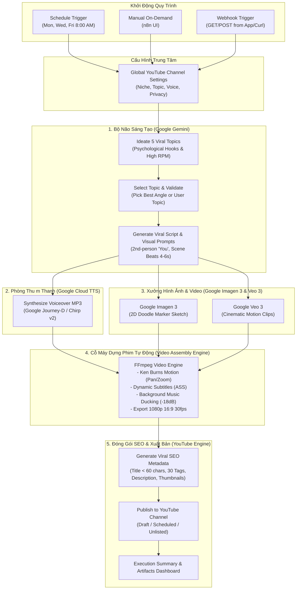

# 🎬 Hướng Dẫn Toàn Diện: Xây Dựng Kênh YouTube Faceless Triệu View Cho Thị Trường Nước Ngoài Bằng Hệ Sinh Thái Google & n8n

> **Báo cáo Chiến Lược & Tài Liệu Kỹ Thuật Chuyên Sâu**  
> **Được thực hiện bởi Hội đồng Chuyên gia:** Solution Architect, n8n Automation Specialist, YouTube Growth Strategist, Video Editor & Motion Director, Generative AI Specialist, Google Cloud & Vertex AI Architect.

---

## 📑 Mục Lục
1. [Bóc Tách Bản Chất Video Mẫu (H2Dev tại mốc 1:36)](#1-bóc-tách-bản-chất-video-mẫu-h2dev-tại-mốc-136)
2. [Đánh Giá Toàn Diện: Tại Sao Bắt Buộc Phải Kết Hợp n8n?](#2-đánh-giá-toàn-diện-tại-sao-bắt-buộc-phải-kết-hợp-n8n)
3. [Chuyển Dịch Toàn Bộ Từ Claude Sang Hệ Sinh Thái Google](#3-chuyển-dịch-toàn-bộ-từ-claude-sang-hệ-sinh-thái-google)
4. [Sơ Đồ Kiến Trúc Hệ Thống (Verified End-to-End Workflow)](#4-sơ-đồ-kiến-trúc-hệ-thống-verified-end-to-end-workflow)
5. [Nghiên Cứu Định Vị Ngách (Niche) Cho Thị Trường US / Global (High RPM)](#5-nghiên-cứu-định-vị-ngách-niche-cho-thị-trường-us--global-high-rpm)
6. [Bộ Prompt Kỹ Thuật Độc Quyền Cho Google Gemini](#6-bộ-prompt-kỹ-thuật-độc-quyền-cho-google-gemini)
7. [Hướng Dẫn Vận Hành n8n & API Endpoints Đã Triển Khai](#7-hướng-dẫn-vận-hành-n8n--api-endpoints-đã-triển-khai)

---

## 1. Bóc Tách Bản Chất Video Mẫu (H2Dev tại mốc 1:36)

Trong video `https://www.youtube.com/watch?v=hpJuB3llhbk&t=96s` (*"Claude Code + YouTube = $39,700/Tháng - Không Cần Lộ Mặt"*), kênh **H2Dev** chia sẻ phương pháp sản xuất video giáo dục/kể chuyện dạng **2D Doodle Animation / Explainer** cho thị trường quốc tế.

### 🎯 3 Yếu Tố Quyết Định "Cỗ Máy In Tiền" Này:
1. **Thị trường nước ngoài (US, UK, CA, AU) - RPM Cực Cao:**  
   - RPM (Doanh thu thực nhận trên 1,000 lượt xem) tại Việt Nam chỉ dao động **$0.3 - $1.0**.
   - Cùng 1 triệu lượt xem đó, nếu là khán giả Mỹ trong ngách Tài chính / Khoa học / Lịch sử, RPM đạt **$15 - $45+**.
   - Do đó, một video đạt 500,000 views tại Mỹ mang về **$10,000 - $20,000 USD**.

2. **Công Thức Giữ Chân Người Xem (Retention Hacking):**  
   - **Góc nhìn ngôi thứ 2 ("You"):** Kịch bản không dùng "tôi" hay "chúng ta" mà đặt người xem làm nhân vật chính (*"You stare at the red candle...", "You wake up 300,000 years ago..."*).
   - **Quy tắc đổi hình ảnh mỗi 3-5 giây:** Não bộ con người bị mất tập trung sau 4 giây tĩnh. Việc đổi scene, đổi góc máy zoom/pan liên tục khiến tỷ lệ rời bỏ video (drop-off) giảm mạnh, đẩy chỉ số Average View Duration (AVD) lên trên 55-65% (điều kiện để YouTube đề xuất video lên hàng triệu view).
   - **Nhịp câu 4 thì:** Câu ngắn -> Câu ngắn -> Một câu dài tạo chiều sâu -> Câu ngắn chốt hạ hoặc một câu hỏi kích thích tư duy.

3. **Điểm Hạn Chế Của Quy Trình Gốc (Claude Code + Thủ Công):**  
   - Quy trình của H2Dev yêu cầu copy paste thủ công giữa Claude -> ElevenLabs -> Midjourney/Flow -> Premiere/CapCut.
   - Tốn 3 - 5 giờ cho mỗi video, không thể mở rộng quy mô (scale), phụ thuộc vào nhiều phần mềm trả phí rời rạc và chi phí token Claude khá cao.

---

## 2. Đánh Giá Toàn Diện: Tại Sao Bắt Buộc Phải Kết Hợp n8n?

Là chuyên gia giải pháp và n8n, câu trả lời dứt khoát là: **RẤT CẦN VÀ N8N LÀ TRÁI TIM ĐIỀU PHỐI TỐI ƯU NHẤT HIỆN NAY**.

| Tiêu Chí | Không Có n8n (Thủ công / Script rời) | Kết Hợp n8n (Automated Orchestration) |
| :--- | :--- | :--- |
| **Xử lý Bất đồng bộ (Async Jobs)** | Dễ timeout, phải canh chờ Google Veo sinh video 1-3 phút | Tự động quản lý hàng đợi, webhook callback, retry khi quá tải |
| **Độ tin cậy & Retry** | API lỗi mạng là hỏng cả tiến trình, mất công làm lại | Tự động lùi thời gian (Exponential Backoff), thử lại thông minh |
| **Giao diện Giám sát** | Chạy terminal mù, không biết video đang kẹt ở khâu nào | Canvas trực quan, xem được dữ liệu JSON, log lỗi từng bước |
| **Trạm duyệt người dùng (HITL)** | Hoặc hoàn toàn tự động rủi ro, hoặc làm tay 100% | n8n gửi kịch bản/ảnh lên Telegram, bạn bấm "Approve" là tự render |
| **Tự động hóa lịch phát (CRON)** | Phải setup crontab phức tạp, khó bảo trì | Đặt lịch Mon-Wed-Fri 8:00 AM chỉ với 1 click |
| **Đăng tải YouTube tự động** | Phải tải file về máy rồi upload thủ công qua web | n8n tích hợp sẵn YouTube node đẩy thẳng video + thumbnail + SEO tags |

---

## 3. Chuyển Dịch Toàn Bộ Từ Claude Sang Hệ Sinh Thái Google

Theo yêu cầu của bạn, hệ thống được cấu hình chuyển đổi **100% sang hệ sinh thái Google**:

| Mắt Xích Sản Xuất | Công Cụ Cũ (Claude Stack) | Công Cụ Google Thay Thế | Lợi Thế Vượt Trội Của Google |
| :--- | :--- | :--- | :--- |
| **Bộ Não & Viết Kịch Bản** | Claude 3.5 Sonnet | **Google Gemini 2.5 Pro / Flash** | Context 2M tokens, chi phí rẻ hơn 5 lần, tốc độ cực nhanh, hỗ trợ xuất JSON Schema chuẩn xác |
| **Nghiên cứu Thị trường** | Perplexity / Claude Search | **Gemini Google Search Grounding** | Truy cập dữ liệu tài chính, tin tức thế giới và báo cáo khảo cổ thời gian thực |
| **Phòng Thu Giọng Đọc** | ElevenLabs | **Google Cloud TTS (Chirp v2 / Journey)** & **NotebookLM Studio** | Giọng native Mỹ siêu tự nhiên (`Journey-D`, `Chirp3-HD`), hoặc 2 MC đối thoại sống động (NotebookLM Studio) |
| **Tạo Ảnh Minh Họa** | Midjourney / DALL-E 3 | **Google Imagen 3 (Vertex AI / AI Studio)** | Khả năng tuân thủ prompt cực tốt, vẽ chữ (typography) trong ảnh sắc nét, phong cách doodle 2D chuẩn xác |
| **Tạo Video Chuyển Động** | Runway Gen-3 / Pika | **Google Veo 2 / Veo 3** | Model sinh video đỉnh cao của Google DeepMind, độ phân giải 1080p/4K, điều khiển camera 3D điện ảnh |
| **Dựng & Ghép Phim** | CapCut / Premiere thủ công | **Automated Video Assembly Engine (FFmpeg)** | Tự động áp dụng hiệu ứng Ken Burns (pan/zoom), phụ đề nhảy chữ động, mix nhạc nền ducking |
| **Đăng Tải & Xuất Bản** | Upload thủ công | **YouTube Data API v3 (Google Cloud)** | Tự động đẩy video, đặt lịch phát, nạp thẻ tags, mô tả chuẩn SEO |

---

## 4. Sơ Đồ Kiến Trúc Hệ Thống (Verified End-to-End Workflow)



---

## 5. Nghiên Cứu Định Vị Ngách (Niche) Cho Thị Trường US / Global (High RPM)

Để đạt được hiệu quả kinh tế lớn nhất, đề xuất 3 định hướng ngách:

### 🏆 Ngách 1: Financial Mysteries & Trading Psychology (Khuyên Dùng Nhất)
* **Lý do:** Tận dụng 100% hạ tầng phân tích thị trường sẵn có của bạn (`TradingAgents` + TradingView capturer).
* **RPM kỳ vọng:** **$30 - $60 USD** (Ngách tài chính Mỹ luôn đứng top 1 YouTube).
* **Chủ đề ví dụ:**
  - *"Why 95% of Traders Lose Money (The Dopamine Trap)"*
  - *"The Day Gold Broke the World Financial System (The 1971 Secret Shock)"*
  - *"How High-Frequency Algorithms Hunt Your Stop Loss in 0.05 Seconds"*
  - *"The 100-Year Monetary Cycle: Why Cash Dies by 2030"*

### 🏹 Ngách 2: Ancient Anthropology & Deep Human Evolution (Chuẩn Format Video H2Dev)
* **Lý do:** Đánh trúng trí tò mò nguyên bản của con người, tệp khán giả toàn cầu khổng lồ.
* **RPM kỳ vọng:** **$10 - $18 USD**.
* **Chủ đề ví dụ:**
  - *"Why You Wouldn't Last 24 Hours in the Stone Age"*
  - *"What Prehistoric Humans Actually Did All Day (The 15-Hour Work Week)"*
  - *"The Bizarre Hygiene Habits of Ancient Civilizations"*

### 🌐 Ngách 3: Macro-Geopolitics & The Shadow Economy
* **Lý do:** Sự quan tâm sâu sắc của khán giả phương Tây về xung đột tiền tệ, chiến tranh kinh tế, chuỗi cung ứng.
* **RPM kỳ vọng:** **$20 - $40 USD**.
* **Chủ đề ví dụ:**
  - *"The Secret Gold War Between Central Banks"*
  - *"How the Petrodollar Hijacked Global Trade"*

---

## 6. Bộ Prompt Kỹ Thuật Độc Quyền Cho Google Gemini

### 📝 Prompt 1: Ideation Engine (Sinh Ý Tưởng Triệu View)
```text
System Instruction:
You are an executive YouTube viral producer specializing in high-RPM faceless explainer channels for US and global tier-1 audiences.
Generate 5 viral, curiosity-gap topics in strict JSON format:
{
  "niche": "...",
  "target_audience": "...",
  "estimated_rpm_usd": "$30 - $50",
  "ideas": [
    {
      "id": 1,
      "title": "Under 60 chars title with high curiosity gap",
      "angle": "Unique perspective",
      "psychological_hook": "First 5-second visceral statement in 2nd person",
      "target_duration_mins": 10,
      "core_twist": "Counterintuitive revelation"
    }
  ]
}
```

### ✍️ Prompt 2: Kịch Bản 10 Phút Giữ Chân Người Xem (Retention Script & Visuals)
```text
System Instruction:
You are an elite YouTube documentary scriptwriter.
CRITICAL RETENTION RULES:
1. Voice: Pure 2nd-person ("you", "your brain", "your wallet"). Never say "we" or "I".
2. Hook: Start with a sensory shock in line 1 ("You watch $5,000 disappear in 30 seconds as the red candle collapses.").
3. Rhythm: Short sentence. Short sentence. One longer sentence building depth. Short sentence. A provocative question every 4-6 sentences.
4. Structure: Hook (0-45s) -> Reframe & Evidence Stack (45s-2m30s) -> Scene Reconstruction (2m30s-6m) -> Counterintuitive Twist (6m-8m30s) -> Modern Mirror & Echo Closing (8m30s-10m).
5. Scene Breakdown: Split the narration into chronological beats of 4-6 seconds each. For every beat, provide:
   - "imagen3_prompt": Style anchor ("Hand-drawn 2D doodle cartoon animation, flat solid colors, bold black outlines, stick figure with spiky orange hair... no gradients, no shadows, 16:9 widescreen")
   - "veo_prompt": Cinematic 3D motion prompt with camera motion for dynamic B-roll clips.
   - "recommended_media_type": "image" or "video"
```

---

## 7. Hướng Dẫn Vận Hành n8n & API Endpoints Đã Triển Khai

Hệ thống đã được tích hợp trực tiếp vào codebase hiện tại và n8n instance của bạn.

### 🚀 1. Kích Hoạt Qua n8n Webhook:
Chạy lệnh curl từ terminal hoặc setup trên webhook client:
```bash
# Kích hoạt tạo video tự động theo ngách mặc định:
curl -s http://localhost:5678/webhook/run-youtube-faceless

# Hoặc truyền chủ đề và ngách tùy chỉnh theo ý muốn:
curl -s -X POST "http://localhost:5678/webhook/run-youtube-faceless" \
  -H "Content-Type: application/json" \
  -d '{
    "topic": "Why 95% of Traders Lose Money (The Dopamine Trap)",
    "niche": "Trading Psychology & Market Mysteries",
    "voice_name": "en-US-Journey-D",
    "target_duration_mins": 10
  }'
```

### 📡 2. Danh Sách API Endpoints Tại Bridge Service (`:8010`):
| Endpoint | Phương thức | Chức năng |
| :--- | :---: | :--- |
| `/api/youtube/ideate-topics` | `POST` | Sinh 5 ý tưởng triệu view kèm RPM ước tính từ Gemini |
| `/api/youtube/generate-script` | `POST` | Sinh kịch bản 2nd-person và chia scene kèm prompt Imagen 3 / Veo 3 |
| `/api/youtube/generate-voiceover` | `POST` | Tạo giọng đọc studio tiếng Anh qua Google Cloud TTS (Journey-D) |
| `/api/youtube/render-video` | `POST` | Dựng video 1080p MP4 tự động với Ken Burns, phụ đề động, mix nhạc |
| `/api/youtube/generate-metadata` | `POST` | Sinh tiêu đề, mô tả chuẩn SEO, 30 thẻ tags, prompt vẽ thumbnail |
| `/api/youtube/full-pipeline` | `POST` | Chạy toàn bộ quy trình All-In-One chỉ trong một lệnh gọi |
| `/api/download/video/{filename}` | `GET` | Tải xuống video 1080p thành phẩm |

### 📁 3. Thư Mục Tài Nguyên Đầu Ra:
* **Video thành phẩm (1080p MP4):** `output/videos/`
* **File âm thanh giọng đọc (MP3):** `output/podcasts/`
* **Hình ảnh & Clips phân cảnh:** `output/videos/scene_media_*.png/mp4`
* **Quy trình n8n đã kích hoạt:** Truy cập `http://localhost:5678` -> Workflow `YouTube Faceless AI Video Production (Google Ecosystem + n8n)`.
