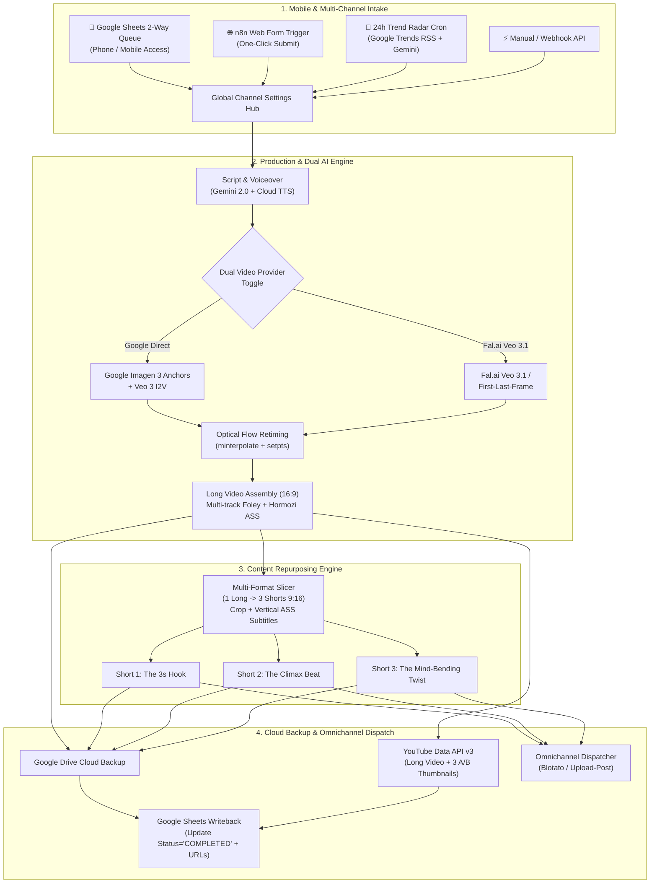

# Studio v3.0 Ultra: Autonomous Multi-Format AI Video Studio

## Overview
Studio v3.0 Ultra bridges the remaining gap between our professional long-form AI rendering engine and international top-tier workflows (such as Dr. Firas's Blotato/Veo templates and Davide Boizza's Google Drive pipeline). It adds phone-based 2-Way Google Sheets & Web Form triggers, a 24-hour Trend Radar for automated viral topic discovery, a Dual AI Video Provider (Google Direct + Fal.ai Veo 3.1 & First-Last-Frame), a 1 Long Video -> 3 Vertical Shorts (9:16) Repurposing Engine, and automated Google Drive backup with optional omnichannel social dispatch.

## Cross-Plan Dependencies
- Preceded by: `plans/plan-full-ai-video-studio.md` (Completed & Verified 100%).
- All existing endpoints (`/api/podcast/*`, `/api/youtube/*`, `/api/youtube/studio/*`) remain 100% backward compatible.

## Phases

| Phase | Name | Priority | Status | Effort |
|-------|------|----------|--------|--------|
| 1 | [Multi-Format Repurposing Engine (1 Long -> 3 Shorts 9:16)](./phase-01-multi-format-repurposing.md) | P1 | Completed | 2h |
| 2 | [24h Trend Radar & Dual AI Video Provider (Google + Fal.ai)](./phase-02-trend-radar-and-dual-provider.md) | P1 | Completed | 2h |
| 3 | [n8n Workflow Expansion (Google Sheets, Form, Drive & Omnichannel)](./phase-03-n8n-workflow-expansion.md) | P1 | Completed | 2.5h |
| 4 | [End-to-End Verification, QA Review & Master Docs Update](./phase-04-verification-and-docs.md) | P1 | Completed | 1.5h |

## Key Architecture & Integration Points

## Dependencies
- FastAP/Uvicorn bridge running in `trading-podcast-bridge` container (port 8010).
- n8n instance running in `trading-podcast-n8n` container (port 5678).
- FFmpeg with `minterpolate`, `zoompan`, `crop`, `boxblur`, `ass/subtitles` filters.
- Optional external credentials: `FAL_KEY` (Fal.ai), `BLOTATO_API_KEY` or `UPLOAD_POST_API_KEY`, `GOOGLE_DRIVE_CREDENTIALS`.
